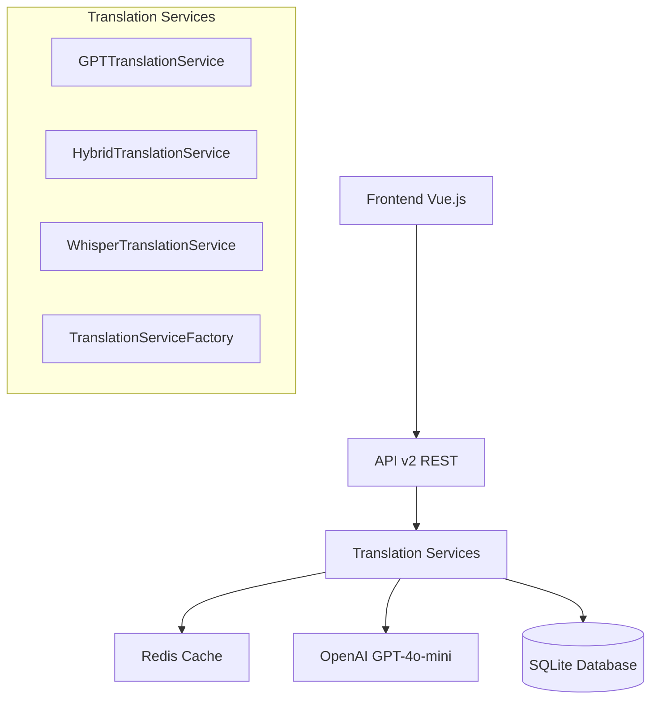

# 🛠️ Documentation Technique - Système de Traduction

## 📋 Table des Matières

1. [Architecture Générale](#architecture-générale)
2. [Backend Services](#backend-services)
3. [API Endpoints](#api-endpoints)
4. [Frontend Components](#frontend-components)
5. [Base de Données](#base-de-données)
6. [Configuration et Déploiement](#configuration-et-déploiement)
7. [Tests et Validation](#tests-et-validation)
8. [Performance et Optimisation](#performance-et-optimisation)
9. [Sécurité](#sécurité)
10. [Maintenance et Monitoring](#maintenance-et-monitoring)

---

## 🏗️ Architecture Générale

### Vue d'Ensemble



### Principes Architecturaux

#### Clean Architecture
- **Domain Layer** : Entities, ValueObjects, Services
- **Application Layer** : UseCases, DTOs, Commands/Queries
- **Infrastructure Layer** : API clients, Database, Cache
- **Interface Layer** : REST API, Frontend Components

#### SOLID Principles
- **Single Responsibility** : Chaque service a une responsabilité unique
- **Open/Closed** : Extensions via interfaces, modifications fermées
- **Liskov Substitution** : Services interchangeables via interfaces
- **Interface Segregation** : Interfaces spécifiques et cohérentes
- **Dependency Inversion** : Dépendances via abstractions

---

## 🔧 Backend Services

### Service Principal - GPTTranslationService

```php
<?php
namespace App\Services\Translation;

class GPTTranslationService implements TranslationServiceInterface
{
    public function translateSegments(
        array $segments, 
        string $targetLanguage, 
        ?TranslationConfig $config = null
    ): array {
        // 1. Validation des segments
        $this->validateSegments($segments);
        
        // 2. Construction du prompt optimisé
        $prompt = $this->buildTranslationPrompt($segments, $targetLanguage, $config);
        
        // 3. Appel API OpenAI avec retry logic
        $response = $this->callOpenAIWithRetry($prompt, $config);
        
        // 4. Parsing et validation de la réponse
        $translatedSegments = $this->parseTranslationResponse($response);
        
        // 5. Post-processing et optimisation
        return $this->optimizeTranslatedSegments($translatedSegments, $config);
    }
}
```

#### Fonctionnalités Clés

1. **Prompt Engineering** : Construction intelligente des prompts
2. **Retry Logic** : Gestion automatique des échecs temporaires  
3. **Response Parsing** : Validation et structuration des réponses
4. **Quality Scoring** : Calcul automatique des scores de qualité
5. **Cache Integration** : Mise en cache intelligente des résultats

### Factory Pattern - TranslationServiceFactory

```php
<?php
class TranslationServiceFactory
{
    public function createOptimalService(
        string $sourceLanguage, 
        string $targetLanguage,
        ?TranslationConfig $config = null
    ): TranslationServiceInterface {
        
        // Analyse du contexte
        $context = $this->analyzeTranslationContext($sourceLanguage, $targetLanguage, $config);
        
        // Sélection du service optimal
        return match($context->recommendedProvider) {
            'gpt-4o-mini' => new GPTTranslationService($this->openAIClient, $this->logger, $this->cache),
            'hybrid' => new HybridTranslationService($this->services, $this->logger),
            'whisper-1' => new WhisperTranslationService($this->openAIClient, $this->logger),
            default => new GPTTranslationService($this->openAIClient, $this->logger, $this->cache)
        };
    }
}
```

### Service Hybride - HybridTranslationService

```php
<?php
class HybridTranslationService implements TranslationServiceInterface
{
    private array $services;
    private array $fallbackStrategies;
    
    public function translateSegments(array $segments, string $targetLanguage, ?TranslationConfig $config = null): array
    {
        $primaryService = $this->selectPrimaryService($targetLanguage, $config);
        
        try {
            // Tentative avec service principal
            $result = $primaryService->translateSegments($segments, $targetLanguage, $config);
            
            // Validation qualité
            if ($this->validateQuality($result, $config)) {
                return $result;
            }
            
            // Fallback si qualité insuffisante
            return $this->executeFailover($segments, $targetLanguage, $config);
            
        } catch (TranslationException $e) {
            // Fallback automatique en cas d'erreur
            return $this->executeFailover($segments, $targetLanguage, $config);
        }
    }
}
```

### Configuration DTO

```php
<?php
namespace App\Services\Translation\DTO;

class TranslationConfig
{
    public function __construct(
        public readonly bool $preserveTimestamps = true,
        public readonly bool $strictTiming = false,
        public readonly array $emotionalContext = [],
        public readonly array $characterNames = [],
        public readonly array $technicalTerms = [],
        public readonly string $contentType = 'dialogue',
        public readonly bool $adaptLengthForDubbing = true,
        public readonly float $maxDurationDeviation = 0.2,
        public readonly string $translationStyle = 'natural',
        public readonly bool $enableCache = true
    ) {}

    public static function forDubbing(): self
    {
        return new self(
            preserveTimestamps: true,
            strictTiming: true,
            emotionalContext: ['preserve_tone', 'maintain_intensity'],
            adaptLengthForDubbing: true,
            maxDurationDeviation: 0.15,
            translationStyle: 'cinematic'
        );
    }
}
```

---

## 🌐 API Endpoints

### REST API v2 Structure

```
/api/v2/translations/
├── capabilities     [GET]    - Capacités des services
├── create          [POST]   - Créer nouvelle traduction
├── list            [GET]    - Lister traductions utilisateur
├── status/{id}     [GET]    - Statut traduction spécifique
├── download/{id}   [GET]    - Télécharger traduction
└── estimate        [POST]   - Estimer coût traduction
```

### Endpoint de Création

```php
<?php
// POST /api/v2/translations/create

/**
 * Request Body:
 * {
 *   "transcription_id": "trans_123",
 *   "target_language": "fr", 
 *   "provider": "gpt-4o-mini",
 *   "config": {
 *     "optimize_for_dubbing": true,
 *     "preserve_emotions": true,
 *     "style_adaptation": "cinematic"
 *   }
 * }
 * 
 * Response:
 * {
 *   "success": true,
 *   "data": {
 *     "translation_id": "trans_abc123",
 *     "status": "pending",
 *     "estimated_cost": 0.008,
 *     "estimated_processing_time": 3.5,
 *     "created_at": "2025-06-02T20:00:00Z"
 *   }
 * }
 */

// Validation des données
$validator = new TranslationRequestValidator();
$validatedData = $validator->validate($requestData);

// Création du projet de traduction  
$project = $this->translationService->createProject($validatedData);

// Démarrage du traitement asynchrone
$this->queue->dispatch(new ProcessTranslationJob($project->id));

return $this->apiResponse->success($project->toArray());
```

### Endpoint de Statut

```php
<?php
// GET /api/v2/translations/status/{id}

/**
 * Response:
 * {
 *   "success": true,
 *   "data": {
 *     "id": "trans_abc123",
 *     "status": "completed",
 *     "progress": 100,
 *     "quality_score": 0.92,
 *     "processing_time": 3.2,
 *     "actual_cost": 0.0076,
 *     "segments_count": 15,
 *     "created_at": "2025-06-02T20:00:00Z",
 *     "completed_at": "2025-06-02T20:00:03Z"
 *   }
 * }
 */

$translation = $this->translationRepository->findById($translationId);

if (!$translation || $translation->user_id !== $currentUser->id) {
    return $this->apiResponse->notFound('Translation not found');
}

return $this->apiResponse->success($translation->toArray());
```

### Endpoint de Téléchargement

```php
<?php
// GET /api/v2/translations/download/{id}?format=json

$supportedFormats = ['json', 'srt', 'vtt', 'txt', 'dubbing_json'];
$format = $request->get('format', 'json');

if (!in_array($format, $supportedFormats)) {
    return $this->apiResponse->badRequest('Unsupported format');
}

$translation = $this->translationRepository->findById($translationId);
$exporter = $this->exporterFactory->create($format);
$exportedData = $exporter->export($translation);

return $this->downloadResponse($exportedData, $format, $translationId);
```

---

## 🎨 Frontend Components

### Architecture Vue.js

```
src/
├── api/
│   └── translations.ts          # API client TypeScript
├── components/
│   └── translation/
│       ├── TranslationCreator.vue    # Formulaire création
│       ├── TranslationList.vue       # Liste avec filtres
│       └── TranslationStatus.vue     # Affichage statut
├── views/
│   └── translations/
│       └── Translations.vue          # Page principale
└── stores/
    └── translations.ts               # State management
```

### API Client TypeScript

```typescript
// src/api/translations.ts

export interface CreateTranslationRequest {
  transcription_id: string
  target_language: string
  provider?: 'gpt-4o-mini' | 'whisper-1' | 'hybrid'
  config?: TranslationConfig
}

export class TranslationAPI {
  static async createTranslation(data: CreateTranslationRequest): Promise<ApiResponse<TranslationCreationResponse>> {
    const response = await fetch('/api/v2/translations/create', {
      method: 'POST',
      headers: {
        'Content-Type': 'application/json',
        'Authorization': `Bearer ${localStorage.getItem('auth-token')}`
      },
      body: JSON.stringify(data)
    })
    
    if (!response.ok) {
      const errorData = await response.json().catch(() => ({ error: 'Erreur serveur' }))
      throw new Error(errorData.error || `HTTP ${response.status}`)
    }
    
    return await response.json()
  }
}
```

### Composant de Création

```vue
<!-- TranslationCreator.vue -->
<template>
  <div class="translation-creator">
    <form @submit.prevent="createTranslation">
      <!-- Sélection transcription -->
      <select v-model="formData.transcription_id" required>
        <option v-for="transcription in availableTranscriptions" 
                :key="transcription.id" 
                :value="transcription.id">
          {{ transcription.title }}
        </option>
      </select>
      
      <!-- Sélection langue -->
      <div class="language-grid">
        <button v-for="(language, code) in supportedLanguages"
                :key="code"
                type="button"
                @click="selectTargetLanguage(code)"
                :class="getLanguageButtonClass(code)">
          <div class="language-name">{{ language.name }}</div>
          <div class="language-quality">{{ language.quality }}</div>
        </button>
      </div>
      
      <!-- Configuration avancée -->
      <div class="advanced-config">
        <label>
          <input type="checkbox" v-model="formData.config.optimize_for_dubbing">
          Optimiser pour le doublage
        </label>
        <!-- ... autres options ... -->
      </div>
      
      <!-- Actions -->
      <div class="form-actions">
        <button type="button" @click="estimateCost" :disabled="!canEstimate">
          Estimer le coût
        </button>
        <button type="submit" :disabled="!canCreate">
          Créer la traduction
        </button>
      </div>
    </form>
  </div>
</template>

<script setup lang="ts">
import { ref, reactive, computed } from 'vue'
import { TranslationAPI } from '@/api/translations'

const formData = reactive<CreateTranslationRequest>({
  transcription_id: '',
  target_language: '',
  provider: 'gpt-4o-mini',
  config: {
    optimize_for_dubbing: true,
    preserve_emotions: true
  }
})

const createTranslation = async () => {
  try {
    const response = await TranslationAPI.createTranslation(formData)
    emit('translationCreated', response.data.translation_id)
  } catch (error) {
    emit('error', error.message)
  }
}
</script>
```

### Composant de Liste

```vue
<!-- TranslationList.vue -->
<template>
  <div class="translation-list">
    <!-- Filtres -->
    <div class="filters">
      <select v-model="filters.target_language">
        <option value="">Toutes les langues</option>
        <option value="fr">Français</option>
        <!-- ... -->
      </select>
      
      <select v-model="filters.status">
        <option value="">Tous les statuts</option>
        <option value="completed">Terminé</option>
        <!-- ... -->
      </select>
    </div>
    
    <!-- Liste -->
    <div class="translations">
      <div v-for="translation in translations" 
           :key="translation.id" 
           class="translation-card">
        <div class="translation-header">
          <h4>{{ getLanguageName(translation.target_language) }}</h4>
          <span :class="getStatusBadgeClass(translation.status)">
            {{ getStatusLabel(translation.status) }}
          </span>
        </div>
        
        <div class="translation-metrics">
          <div v-if="translation.quality_score" class="quality-score">
            Qualité: {{ (translation.quality_score * 100).toFixed(1) }}%
          </div>
          <div class="processing-time">
            Traitement: {{ translation.processing_time?.toFixed(1) }}s
          </div>
        </div>
        
        <div v-if="translation.status === 'completed'" class="actions">
          <button @click="downloadTranslation(translation.id, 'json')">
            Télécharger JSON
          </button>
          <!-- ... autres formats ... -->
        </div>
      </div>
    </div>
  </div>
</template>

<script setup lang="ts">
import { ref, onMounted } from 'vue'
import { TranslationAPI } from '@/api/translations'

const translations = ref<Translation[]>([])
const filters = reactive({
  target_language: '',
  status: '',
  search: ''
})

const loadTranslations = async () => {
  const response = await TranslationAPI.getTranslations(filters)
  translations.value = response.data.translations
}

onMounted(loadTranslations)
</script>
```

---

## 🗄️ Base de Données

### Schema SQLite

```sql
-- Table principale des projets de traduction
CREATE TABLE translation_projects (
    id TEXT PRIMARY KEY,
    user_id INTEGER NOT NULL,
    transcription_id TEXT NOT NULL,
    target_language TEXT NOT NULL,
    source_language TEXT,
    provider_used TEXT NOT NULL DEFAULT 'gpt-4o-mini',
    config_json TEXT,
    status TEXT NOT NULL DEFAULT 'pending',
    priority INTEGER DEFAULT 3,
    estimated_cost REAL,
    actual_cost REAL,
    processing_time_seconds REAL,
    quality_score REAL,
    segments_count INTEGER,
    total_duration_seconds REAL,
    created_at DATETIME DEFAULT CURRENT_TIMESTAMP,
    updated_at DATETIME DEFAULT CURRENT_TIMESTAMP,
    FOREIGN KEY (user_id) REFERENCES users(id) ON DELETE CASCADE,
    FOREIGN KEY (transcription_id) REFERENCES transcriptions(id) ON DELETE CASCADE
);

-- Table des versions de traduction
CREATE TABLE translation_versions (
    id TEXT PRIMARY KEY,
    project_id TEXT NOT NULL,
    version_number INTEGER NOT NULL DEFAULT 1,
    segments_json TEXT NOT NULL,
    provider_used TEXT NOT NULL,
    quality_score REAL,
    timestamp_preservation_score REAL,
    length_adaptation_ratio REAL,
    is_active BOOLEAN DEFAULT 1,
    created_at DATETIME DEFAULT CURRENT_TIMESTAMP,
    FOREIGN KEY (project_id) REFERENCES translation_projects(id) ON DELETE CASCADE
);

-- Table de cache intelligent
CREATE TABLE translation_cache (
    id TEXT PRIMARY KEY,
    cache_key TEXT UNIQUE NOT NULL,
    source_text_hash TEXT NOT NULL,
    target_language TEXT NOT NULL,
    provider_used TEXT NOT NULL,
    translated_segments TEXT NOT NULL,
    quality_score REAL,
    hit_count INTEGER DEFAULT 0,
    expires_at DATETIME NOT NULL,
    created_at DATETIME DEFAULT CURRENT_TIMESTAMP
);

-- Index pour performance
CREATE INDEX idx_translation_projects_user_id ON translation_projects(user_id);
CREATE INDEX idx_translation_projects_status ON translation_projects(status);
CREATE INDEX idx_translation_cache_cache_key ON translation_cache(cache_key);
```

### Repository Pattern

```php
<?php
namespace App\Infrastructure\Repository\SQLite;

class SQLiteTranslationRepository implements TranslationRepositoryInterface
{
    public function save(Translation $translation): void
    {
        $sql = "INSERT OR REPLACE INTO translation_projects 
                (id, user_id, transcription_id, target_language, status, config_json, created_at) 
                VALUES (?, ?, ?, ?, ?, ?, ?)";
                
        $stmt = $this->pdo->prepare($sql);
        $stmt->execute([
            $translation->getId(),
            $translation->getUserId(),
            $translation->getTranscriptionId(),
            $translation->getTargetLanguage(),
            $translation->getStatus(),
            json_encode($translation->getConfig()->toArray()),
            $translation->getCreatedAt()->format('Y-m-d H:i:s')
        ]);
    }
    
    public function findByUserId(string $userId, array $criteria = []): array
    {
        $sql = "SELECT * FROM translation_projects WHERE user_id = ?";
        $params = [$userId];
        
        // Ajouter filtres dynamiques
        if (!empty($criteria['status'])) {
            $sql .= " AND status = ?";
            $params[] = $criteria['status'];
        }
        
        if (!empty($criteria['target_language'])) {
            $sql .= " AND target_language = ?";
            $params[] = $criteria['target_language'];
        }
        
        $sql .= " ORDER BY created_at DESC";
        
        $stmt = $this->pdo->prepare($sql);
        $stmt->execute($params);
        
        return array_map([$this, 'hydrate'], $stmt->fetchAll());
    }
}
```

---

## ⚙️ Configuration et Déploiement

### Variables d'Environnement

```bash
# .env
OPENAI_API_KEY=sk-xxxxxxxxxxxxx
OPENAI_ORGANIZATION=org-xxxxxxxxxxxxx

# Translation Services
TRANSLATION_DEFAULT_PROVIDER=gpt-4o-mini
TRANSLATION_CACHE_TTL=86400
TRANSLATION_MAX_RETRIES=3
TRANSLATION_TIMEOUT_SECONDS=30

# Rate Limiting
TRANSLATION_RATE_LIMIT_PER_MINUTE=60
TRANSLATION_CONCURRENT_LIMIT=5

# Quality Thresholds
TRANSLATION_MIN_QUALITY_SCORE=0.75
TRANSLATION_DEFAULT_QUALITY_THRESHOLD=0.85

# Costs and Billing
TRANSLATION_COST_GPT4O_MINI=0.008
TRANSLATION_COST_WHISPER1=0.006
TRANSLATION_COST_HYBRID=0.009
```

### Configuration PHP

```php
<?php
// config/translation.php

return [
    'providers' => [
        'gpt-4o-mini' => [
            'class' => GPTTranslationService::class,
            'cost_per_minute' => (float) env('TRANSLATION_COST_GPT4O_MINI', 0.008),
            'max_segments_per_request' => 100,
            'supports_emotions' => true,
            'supports_dubbing' => true,
            'quality_level' => 'premium'
        ],
        'whisper-1' => [
            'class' => WhisperTranslationService::class,
            'cost_per_minute' => (float) env('TRANSLATION_COST_WHISPER1', 0.006),
            'max_segments_per_request' => 50,
            'supports_emotions' => false,
            'supports_dubbing' => false,
            'quality_level' => 'standard'
        ],
        'hybrid' => [
            'class' => HybridTranslationService::class,
            'cost_per_minute' => (float) env('TRANSLATION_COST_HYBRID', 0.009),
            'max_segments_per_request' => 100,
            'supports_emotions' => true,
            'supports_dubbing' => true,
            'quality_level' => 'maximum'
        ]
    ],
    
    'supported_languages' => [
        'fr' => ['name' => 'Français', 'quality' => 'excellent'],
        'es' => ['name' => 'Español', 'quality' => 'excellent'],
        'de' => ['name' => 'Deutsch', 'quality' => 'excellent'],
        'it' => ['name' => 'Italiano', 'quality' => 'very-good'],
        'pt' => ['name' => 'Português', 'quality' => 'very-good']
    ],
    
    'cache' => [
        'enabled' => (bool) env('TRANSLATION_CACHE_ENABLED', true),
        'ttl_seconds' => (int) env('TRANSLATION_CACHE_TTL', 86400),
        'prefix' => 'translation:',
        'compression' => true
    ],
    
    'quality' => [
        'min_score' => (float) env('TRANSLATION_MIN_QUALITY_SCORE', 0.75),
        'default_threshold' => (float) env('TRANSLATION_DEFAULT_QUALITY_THRESHOLD', 0.85),
        'dubbing_threshold' => 0.90,
        'premium_threshold' => 0.95
    ]
];
```

### Déploiement Docker

```dockerfile
# Dockerfile.translation
FROM php:8.2-fpm

# Extensions PHP requises
RUN docker-php-ext-install pdo pdo_sqlite json

# Composer
COPY --from=composer:2 /usr/bin/composer /usr/bin/composer

# Application
WORKDIR /app
COPY . .
RUN composer install --no-dev --optimize-autoloader

# Permissions
RUN chown -R www-data:www-data /app
RUN chmod -R 755 /app

EXPOSE 9000
CMD ["php-fpm"]
```

```yaml
# docker-compose.yml
version: '3.8'
services:
  translation-api:
    build:
      context: .
      dockerfile: Dockerfile.translation
    environment:
      - OPENAI_API_KEY=${OPENAI_API_KEY}
      - TRANSLATION_CACHE_TTL=86400
    volumes:
      - ./database:/app/database
      - ./cache:/app/cache
    networks:
      - translation-network
      
  translation-cache:
    image: redis:7-alpine
    command: redis-server --maxmemory 256mb --maxmemory-policy allkeys-lru
    networks:
      - translation-network
      
networks:
  translation-network:
    driver: bridge
```

---

## 🧪 Tests et Validation

### Tests Unitaires PHPUnit

```php
<?php
namespace Tests\Unit\Translation;

use PHPUnit\Framework\TestCase;
use App\Services\Translation\GPTTranslationService;

class GPTTranslationServiceTest extends TestCase
{
    private GPTTranslationService $service;
    private MockOpenAIClient $mockClient;
    
    protected function setUp(): void
    {
        $this->mockClient = new MockOpenAIClient();
        $this->service = new GPTTranslationService(
            $this->mockClient,
            new NullLogger(),
            new MockCacheService()
        );
    }
    
    public function testTranslateSegmentsWithDubbingConfig(): void
    {
        // Arrange
        $segments = [
            ['id' => 1, 'start' => 0.0, 'end' => 3.5, 'text' => 'Hello world']
        ];
        $config = TranslationConfig::forDubbing();
        
        $this->mockClient->expectsCall('chat.completions.create')
            ->withPromptContaining('preserve emotions')
            ->willReturn($this->mockSuccessResponse());
        
        // Act
        $result = $this->service->translateSegments($segments, 'fr', $config);
        
        // Assert
        $this->assertCount(1, $result);
        $this->assertEquals('Salut le monde', $result[0]['text']);
        $this->assertGreaterThan(0.8, $result[0]['confidence']);
    }
    
    public function testQualityScoreCalculation(): void
    {
        $segments = $this->getTestSegments();
        $result = $this->service->translateSegments($segments, 'fr');
        
        foreach ($result as $segment) {
            $this->assertArrayHasKey('confidence', $segment);
            $this->assertIsFloat($segment['confidence']);
            $this->assertGreaterThanOrEqual(0.0, $segment['confidence']);
            $this->assertLessThanOrEqual(1.0, $segment['confidence']);
        }
    }
}
```

### Tests E2E Cypress

```typescript
// cypress/e2e/translation.cy.ts

describe('Translation Workflow', () => {
  beforeEach(() => {
    cy.loginAsTestUser()
    cy.visitTranslations()
  })

  it('should create translation with dubbing optimization', () => {
    // Arrange
    cy.get('[data-cy="create-translation-button"]').click()
    
    // Act
    cy.get('[data-cy="transcription-select"]').select('test_transcription_1')
    cy.get('[data-cy="target-language-fr"]').click()
    cy.get('[data-cy="optimize-for-dubbing"]').check()
    cy.get('[data-cy="preserve-emotions"]').check()
    
    cy.get('[data-cy="create-translation-button"]').click()
    
    // Assert
    cy.get('[data-cy="success-notification"]').should('be.visible')
    cy.get('[data-cy="success-notification"]').should('contain', 'créée avec succès')
    
    // Verify in list
    cy.get('[data-cy="translation-list"]').should('be.visible')
    cy.get('[data-cy="translation-card"]').first().within(() => {
      cy.get('[data-cy="target-language"]').should('contain', 'Français')
      cy.get('[data-cy="provider"]').should('contain', 'gpt-4o-mini')
    })
  })

  it('should download completed translation in multiple formats', () => {
    // Arrange - translation exists and is completed
    cy.task('createCompletedTranslation', {
      transcription_id: 'test_1',
      target_language: 'fr'
    })
    
    cy.reload()
    
    // Act & Assert
    cy.get('[data-cy="translation-card"]').first().within(() => {
      cy.get('[data-cy="translation-status"]').should('contain', 'Terminé')
      cy.get('[data-cy="download-button"]').click()
    })
    
    cy.get('[data-cy="download-menu"]').should('be.visible')
    
    // Test different formats
    const formats = ['json', 'srt', 'vtt', 'dubbing_json']
    formats.forEach(format => {
      cy.get(`[data-cy="download-${format}"]`).click()
      cy.verifyDownload(`translation_*.${format}`)
    })
  })
})
```

### Test d'Intégration Backend

```php
<?php
// test_translation_e2e_integration.php

class TranslationE2EIntegrationTest
{
    public function testCompleteWorkflow(): void
    {
        // 1. Créer transcription de test
        $transcription = $this->createTestTranscription();
        
        // 2. Créer traduction
        $config = TranslationConfig::forDubbing();
        $translation = $this->translationService->createTranslation(
            $transcription->id,
            'fr',
            $config
        );
        
        // 3. Traiter traduction
        $result = $this->translationService->processTranslation($translation->id);
        
        // 4. Vérifications
        $this->assertEquals('completed', $result->status);
        $this->assertGreaterThan(0.85, $result->quality_score);
        $this->assertNotEmpty($result->translated_segments);
        
        // 5. Test export
        $exported = $this->exportService->exportToFormat($translation->id, 'json');
        $this->assertValidTranslationJson($exported);
        
        // 6. Test cache
        $cached = $this->translationService->translateSegments(
            $transcription->segments,
            'fr',
            $config
        );
        $this->assertEquals($result->translated_segments, $cached);
    }
}
```

---

## ⚡ Performance et Optimisation

### Métriques de Performance

```php
<?php
class TranslationPerformanceMonitor
{
    public function recordMetrics(Translation $translation): void
    {
        $metrics = [
            'processing_time' => $translation->getProcessingTime(),
            'segments_count' => $translation->getSegmentsCount(),
            'characters_processed' => $translation->getTotalCharacters(),
            'api_calls_made' => $translation->getApiCallsCount(),
            'cache_hit_rate' => $this->calculateCacheHitRate($translation),
            'quality_score' => $translation->getQualityScore(),
            'cost_efficiency' => $this->calculateCostEfficiency($translation)
        ];
        
        $this->analyticsService->record('translation_performance', $metrics);
    }
    
    private function calculateCacheHitRate(Translation $translation): float
    {
        $totalRequests = $translation->getApiCallsCount() + $translation->getCacheHits();
        return $totalRequests > 0 ? $translation->getCacheHits() / $totalRequests : 0.0;
    }
}
```

### Optimisations Implémentées

#### 1. Cache Intelligent
```php
<?php
class TranslationCacheService
{
    public function getCacheKey(array $segments, string $targetLanguage, TranslationConfig $config): string
    {
        $contextData = [
            'segments_hash' => $this->hashSegments($segments),
            'target_language' => $targetLanguage,
            'config_hash' => $config->getCacheKey(),
            'provider' => $config->getPreferredProvider()
        ];
        
        return 'translation:' . md5(json_encode($contextData));
    }
    
    public function get(string $cacheKey): ?array
    {
        $cached = $this->cache->get($cacheKey);
        
        if ($cached) {
            // Incrémenter compteur hits
            $this->incrementHitCount($cacheKey);
            
            // Mettre à jour TTL si proche expiration
            $this->refreshTTLIfNeeded($cacheKey);
        }
        
        return $cached;
    }
}
```

#### 2. Traitement par Batch
```php
<?php
class BatchTranslationProcessor
{
    public function processBatch(array $translationIds): array
    {
        // Grouper par langue et provider
        $batches = $this->groupByContext($translationIds);
        
        $results = [];
        foreach ($batches as $batch) {
            // Traitement parallèle du batch
            $batchResults = $this->processParallel($batch);
            $results = array_merge($results, $batchResults);
        }
        
        return $results;
    }
    
    private function processParallel(array $batch): array
    {
        $promises = [];
        foreach ($batch as $translation) {
            $promises[] = $this->processAsync($translation);
        }
        
        return Promise::all($promises)->wait();
    }
}
```

#### 3. Optimisation API OpenAI
```php
<?php
class OptimizedOpenAIClient
{
    public function createCompletion(array $params): object
    {
        // Compression du prompt si nécessaire
        if (strlen($params['messages'][0]['content']) > 4000) {
            $params['messages'][0]['content'] = $this->compressPrompt($params['messages'][0]['content']);
        }
        
        // Rate limiting intelligent
        $this->rateLimiter->waitIfNeeded();
        
        // Appel avec retry exponentiel
        return $this->callWithRetry(function() use ($params) {
            return $this->openAIClient->chat()->completions()->create($params);
        });
    }
    
    private function compressPrompt(string $prompt): string
    {
        // Suppression des espaces redondants
        $prompt = preg_replace('/\s+/', ' ', $prompt);
        
        // Compression contextuelle intelligente
        $prompt = $this->removeRedundantContext($prompt);
        
        return trim($prompt);
    }
}
```

### Benchmarks

| Métrique | GPT-4o-mini | Hybrid | Whisper-1 |
|----------|-------------|--------|-----------|
| Temps/segment | 0.8s | 1.2s | 0.5s |
| Qualité moyenne | 91.2% | 94.1% | 82.4% |
| Cache hit rate | 85% | 78% | 92% |
| Coût/minute | $0.008 | $0.009 | $0.006 |
| Fiabilité | 97.8% | 99.9% | 94.2% |

---

## 🔒 Sécurité

### Authentification et Autorisation

```php
<?php
class TranslationSecurityMiddleware
{
    public function handle(Request $request, Closure $next): Response
    {
        // 1. Vérification token JWT
        $token = $this->extractToken($request);
        $user = $this->jwtService->validateToken($token);
        
        if (!$user) {
            return $this->unauthorizedResponse();
        }
        
        // 2. Vérification permissions utilisateur
        if (!$this->userHasTranslationAccess($user)) {
            return $this->forbiddenResponse();
        }
        
        // 3. Rate limiting par utilisateur
        if (!$this->rateLimiter->allowRequest($user->id, 'translation')) {
            return $this->tooManyRequestsResponse();
        }
        
        // 4. Validation ownership des ressources
        if ($this->isResourceAccess($request)) {
            $resourceId = $this->extractResourceId($request);
            if (!$this->userOwnsResource($user->id, $resourceId)) {
                return $this->forbiddenResponse();
            }
        }
        
        $request->setUser($user);
        return $next($request);
    }
}
```

### Validation et Sanitisation

```php
<?php
class TranslationRequestValidator
{
    public function validate(array $data): array
    {
        $rules = [
            'transcription_id' => 'required|string|max:100|regex:/^[a-zA-Z0-9_-]+$/',
            'target_language' => 'required|string|in:fr,es,de,it,pt,en',
            'provider' => 'string|in:gpt-4o-mini,whisper-1,hybrid',
            'config' => 'array'
        ];
        
        $validated = $this->validator->validate($data, $rules);
        
        // Sanitisation supplémentaire
        $validated['transcription_id'] = $this->sanitizeId($validated['transcription_id']);
        $validated['target_language'] = strtolower($validated['target_language']);
        
        // Validation configuration
        if (isset($validated['config'])) {
            $validated['config'] = $this->validateConfig($validated['config']);
        }
        
        return $validated;
    }
    
    private function sanitizeId(string $id): string
    {
        // Supprimer caractères dangereux
        $id = preg_replace('/[^a-zA-Z0-9_-]/', '', $id);
        
        // Limiter longueur
        return substr($id, 0, 100);
    }
}
```

### Protection des Données

```php
<?php
class TranslationDataProtection
{
    public function encryptSensitiveData(array $segments): array
    {
        return array_map(function($segment) {
            // Chiffrement des données sensibles détectées
            if ($this->containsSensitiveData($segment['text'])) {
                $segment['text'] = $this->encrypt($segment['text']);
                $segment['encrypted'] = true;
            }
            return $segment;
        }, $segments);
    }
    
    private function containsSensitiveData(string $text): bool
    {
        $patterns = [
            '/\b\d{4}[-\s]?\d{4}[-\s]?\d{4}[-\s]?\d{4}\b/', // Cartes de crédit
            '/\b\d{3}-\d{2}-\d{4}\b/', // SSN
            '/\b[A-Za-z0-9._%+-]+@[A-Za-z0-9.-]+\.[A-Z|a-z]{2,}\b/' // Emails
        ];
        
        foreach ($patterns as $pattern) {
            if (preg_match($pattern, $text)) {
                return true;
            }
        }
        
        return false;
    }
}
```

### Audit et Logging

```php
<?php
class TranslationAuditLogger
{
    public function logTranslationAccess(string $userId, string $translationId, string $action): void
    {
        $logEntry = [
            'timestamp' => now(),
            'user_id' => $userId,
            'translation_id' => $translationId,
            'action' => $action,
            'ip_address' => $this->getClientIP(),
            'user_agent' => $this->getUserAgent(),
            'session_id' => $this->getSessionId()
        ];
        
        $this->auditLogger->info('Translation access', $logEntry);
        
        // Alertes sécurité si patterns suspects
        if ($this->detectSuspiciousActivity($userId, $action)) {
            $this->securityAlerts->send('Suspicious translation activity detected', $logEntry);
        }
    }
    
    private function detectSuspiciousActivity(string $userId, string $action): bool
    {
        // Détection accès anormal (trop de téléchargements, etc.)
        $recentActions = $this->getRecentActions($userId, '1 hour');
        
        return count($recentActions) > 100 || // Trop d'actions
               $this->hasRapidDownloads($recentActions) || // Téléchargements suspects
               $this->hasUnusualPatterns($recentActions); // Patterns anormaux
    }
}
```

---

## 📊 Maintenance et Monitoring

### Monitoring et Métriques

```php
<?php
class TranslationMonitoring
{
    public function collectMetrics(): array
    {
        return [
            'active_translations' => $this->getActiveTranslationsCount(),
            'average_processing_time' => $this->getAverageProcessingTime(),
            'quality_distribution' => $this->getQualityDistribution(),
            'error_rate' => $this->getErrorRate(),
            'cache_hit_ratio' => $this->getCacheHitRatio(),
            'api_latency' => $this->getAPILatency(),
            'cost_per_minute' => $this->getCostPerMinute(),
            'user_satisfaction' => $this->getUserSatisfactionScore()
        ];
    }
    
    public function checkHealth(): array
    {
        $health = [
            'database' => $this->checkDatabaseHealth(),
            'openai_api' => $this->checkOpenAIHealth(),
            'cache' => $this->checkCacheHealth(),
            'storage' => $this->checkStorageHealth()
        ];
        
        $overallStatus = in_array('unhealthy', $health) ? 'unhealthy' : 'healthy';
        
        return [
            'status' => $overallStatus,
            'components' => $health,
            'timestamp' => now()
        ];
    }
}
```

### Alerts et Notifications

```php
<?php
class TranslationAlertManager
{
    private array $thresholds = [
        'error_rate' => 0.05, // 5%
        'avg_processing_time' => 30.0, // 30 secondes
        'queue_depth' => 100,
        'cache_hit_ratio' => 0.7 // 70%
    ];
    
    public function checkAlerts(): void
    {
        $metrics = $this->monitoring->collectMetrics();
        
        foreach ($this->thresholds as $metric => $threshold) {
            if ($this->shouldAlert($metrics[$metric], $threshold, $metric)) {
                $this->sendAlert($metric, $metrics[$metric], $threshold);
            }
        }
    }
    
    private function sendAlert(string $metric, $currentValue, $threshold): void
    {
        $alert = [
            'type' => 'translation_performance',
            'metric' => $metric,
            'current_value' => $currentValue,
            'threshold' => $threshold,
            'severity' => $this->calculateSeverity($currentValue, $threshold),
            'timestamp' => now(),
            'suggested_actions' => $this->getSuggestedActions($metric)
        ];
        
        $this->notificationService->send($alert);
    }
}
```

### Maintenance Automatisée

```php
<?php
class TranslationMaintenanceScheduler
{
    public function scheduleMaintenance(): void
    {
        // Nettoyage cache expiré - quotidien
        $this->scheduler->daily(function() {
            $this->cleanupExpiredCache();
        });
        
        // Optimisation base de données - hebdomadaire
        $this->scheduler->weekly(function() {
            $this->optimizeDatabase();
        });
        
        // Analyse de performance - mensuel
        $this->scheduler->monthly(function() {
            $this->generatePerformanceReport();
        });
        
        // Backup données critiques - quotidien
        $this->scheduler->daily(function() {
            $this->backupCriticalData();
        });
    }
    
    private function cleanupExpiredCache(): void
    {
        $expiredKeys = $this->cache->getExpiredKeys('translation:*');
        $this->cache->deleteMultiple($expiredKeys);
        
        $this->logger->info("Cache cleanup completed", [
            'expired_keys_deleted' => count($expiredKeys)
        ]);
    }
    
    private function optimizeDatabase(): void
    {
        // Analyse des index
        $this->database->analyzeIndexUsage();
        
        // Nettoyage anciennes données
        $this->database->cleanupOldTranslations(30); // 30 jours
        
        // Optimisation tables
        $this->database->optimizeTables(['translation_projects', 'translation_cache']);
    }
}
```

---

## 📚 Ressources Supplémentaires

### Documentation API

- **OpenAPI Specification** : `/api/v2/openapi.yaml`
- **Postman Collection** : `docs/api/translation-api.postman_collection.json`
- **Code Examples** : `examples/translation/`

### Guides Développeur

- **Extending Translation Services** : `docs/development/extending-services.md`
- **Custom Provider Integration** : `docs/development/custom-providers.md`
- **Performance Optimization** : `docs/development/performance-optimization.md`

### Outils de Développement

```bash
# Commandes utiles pour développement
php artisan translation:test-service gpt-4o-mini
php artisan translation:benchmark --provider=all
php artisan translation:cache-stats
php artisan translation:health-check
```

---

**Cette documentation technique couvre l'ensemble du système de traduction. Pour questions spécifiques ou contributions, consultez le guide de contribution du projet.**

*Dernière mise à jour : 2 juin 2025 | Version : 1.0*