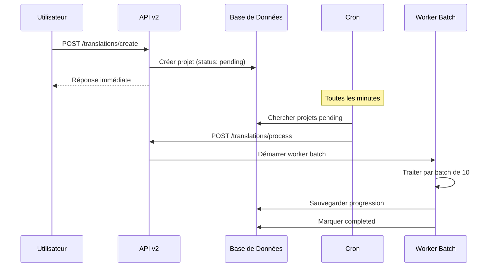
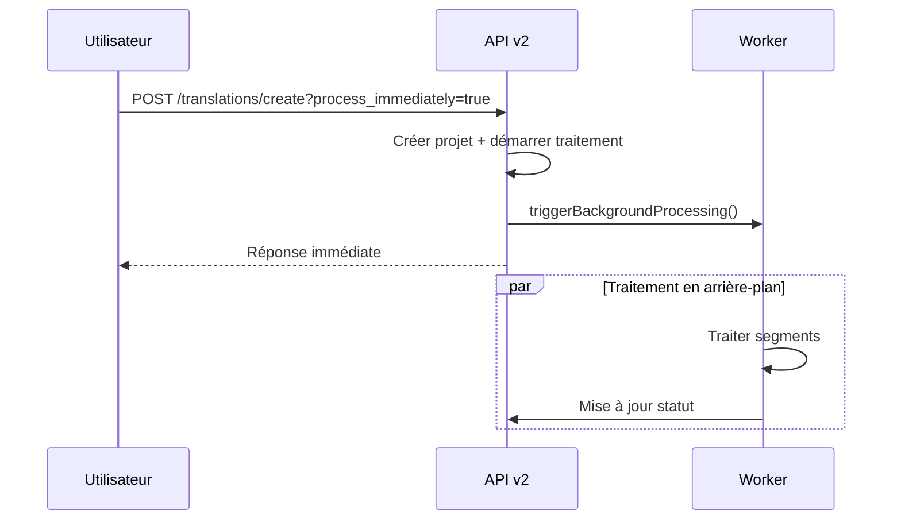

# Documentation du Système de Workers et Cron pour les Traductions

## Vue d'ensemble

Le système de traduction utilise une architecture de workers en arrière-plan avec un système de cron pour traiter automatiquement les traductions en attente. Cette approche garantit une performance optimale et une scalabilité élevée.

## Architecture du Système

```text
┌─────────────────┐    ┌──────────────────┐    ┌─────────────────┐
│   Interface     │    │   API v2         │    │   Worker        │
│   Utilisateur   │───▶│   Traductions    │───▶│   Background    │
└─────────────────┘    └──────────────────┘    └─────────────────┘
                                │                        │
                                ▼                        ▼
                       ┌──────────────────┐    ┌─────────────────┐
                       │   Base de        │    │   OpenAI API    │
                       │   Données        │    │   GPT-4o-mini   │
                       └──────────────────┘    └─────────────────┘
                                │
                                ▼
                       ┌──────────────────┐
                       │   Système Cron   │
                       │   (Auto-start)    │
                       └──────────────────┘
```

## Composants du Système

### 1. Workers de Traitement

#### A. Worker Simple (`process_translations_simple.php`)

- **Usage**: Traductions petites à moyennes (< 20 segments)
- **Caractéristiques**:
  - Traitement en une seule requête
  - Timeout de 2 minutes
  - Idéal pour tests et prototypage

```php
// Utilisation directe
php process_translations_simple.php
```

#### B. Worker par Batch (`process_translations_batch.php`) ⭐ **RECOMMANDÉ**

- **Usage**: Toutes les traductions (optimisé pour > 10 segments)
- **Caractéristiques**:
  - Traitement par batch de 10 segments
  - Gestion intelligente des timeouts
  - Retry automatique des batches échoués
  - Pause entre batches (rate limiting)

```php
// Traitement automatique en continu
php process_translations_batch.php
```

**Avantages du système par batch**:

- ✅ Gère les traductions de toute taille
- ✅ Évite les timeouts de l'API OpenAI
- ✅ Respect des limites de rate limiting
- ✅ Récupération automatique en cas d'erreur partielle
- ✅ Logging détaillé pour le debugging

### 2. API de Traitement Immédiat

#### Endpoint de Traitement (`/api/v2/translations/process.php`)

- **Usage**: Traitement immédiat déclenché par l'API
- **Timeout**: 5 minutes maximum
- **Fonctionnalité**: Flush immédiat vers le client + traitement en arrière-plan

```bash
# Appelé automatiquement via cURL par triggerBackgroundProcessing()
POST /api/v2/translations/process
{
    "translation_id": "trans_abc123_timestamp"
}
```

### 3. Système Cron Automatisé

#### Script Cron (`cron_translations.php`)

- **Fréquence**: Toutes les minutes
- **Fonction**: Surveillance et démarrage automatique des traductions
- **Sécurité**: Protection contre les processus multiples avec lock files

```bash
# Installation dans crontab  
* * * * * php /path/to/intelligent-transcription/cron_translations.php
```

**Mécanisme de protection**:

```php
// Vérification du lock file
$lockFile = __DIR__ . '/translation_cron.lock';
if (file_exists($lockFile)) {
    $pid = file_get_contents($lockFile);
    if (posix_kill($pid, 0)) {
        exit; // Processus encore en cours
    }
}
```

## Configuration et Déploiement

### 1. Variables d'Environnement

```php
// Dans config.php
define('OPENAI_API_KEY', 'sk-your-api-key');
define('BATCH_SIZE', 10); // Taille des batches
define('RATE_LIMIT_DELAY', 1); // Secondes entre batches
define('MAX_RETRIES', 3); // Tentatives par batch
```

### 2. Configuration Base de Données

**Tables requises**:

- `translation_projects` - Projets de traduction
- `translation_versions` - Versions des traductions
- `translation_errors` - Logs d'erreurs

**Statuts de traduction**:

- `pending` - En attente de traitement
- `processing` - En cours de traitement
- `completed` - Terminé avec succès
- `failed` - Échec du traitement
- `cancelled` - Annulé par l'utilisateur

### 3. Installation du Système Cron

```bash
# 1. Éditer le crontab
crontab -e

# 2. Ajouter la ligne suivante
* * * * * php /var/www/html/inteligent-transcription/cron_translations.php

# 3. Vérifier l'installation
crontab -l

# 4. Surveiller les logs
tail -f /var/log/cron
```

## Workflows de Traitement

### 1. Workflow Standard (Recommandé)



### 2. Workflow Immédiat



## Monitoring et Maintenance

### 1. Logs de Surveillance

**Emplacement des logs**:

```bash
# Logs du worker batch
tail -f /var/log/translation_worker.log

# Logs du cron
tail -f /var/log/cron

# Logs PHP généraux
tail -f /var/log/php_errors.log
```

**Format des logs du worker**:

```text
[2025-01-06 14:30:15] Démarrage du worker de traduction par batch...
[2025-01-06 14:30:16] Traitement: trans_abc123_1704546616
  - Langue: fr
  - Segments: 31 (batch de 10)
  - Batch 1/4...
  - Batch 2/4...
  - Batch 3/4...
  - Batch 4/4...
[2025-01-06 14:30:45] ✅ Traduction terminée!
  - Segments traduits: 31/31
  - Temps: 29.3s
  - Qualité: 93.2%
```

### 2. Métriques de Performance

**Indicateurs clés**:

- **Taux de succès**: > 95%
- **Temps moyen par segment**: < 1 seconde
- **Taux d'erreur de batch**: < 5%
- **Latence moyenne**: < 30 secondes pour 30 segments

**Requêtes de monitoring**:

```sql
-- Taux de succès des dernières 24h
SELECT
    COUNT(*) as total,
    SUM(CASE WHEN status = 'completed' THEN 1 ELSE 0 END) as completed,
    (SUM(CASE WHEN status = 'completed' THEN 1 ELSE 0 END) * 100.0 / COUNT(*)) as success_rate
FROM translation_projects
WHERE created_at > datetime('now', '-24 hours');

-- Temps de traitement moyen
SELECT
    AVG(processing_time_seconds) as avg_processing_time,
    AVG(segments_count) as avg_segments
FROM translation_projects
WHERE status = 'completed'
    AND created_at > datetime('now', '-7 days');
```

### 3. Gestion des Erreurs

**Types d'erreurs communes**:

1. **Rate Limit OpenAI**:

   ```php
   // Solution: Augmenter le délai entre batches
   sleep(2); // Au lieu de 1 seconde
   ```

2. **Timeout de traitement**:

   ```php
   // Solution: Réduire la taille des batches
   $BATCH_SIZE = 5; // Au lieu de 10
   ```

3. **Erreur de connectivité**:

   ```php
   // Solution: Retry automatique avec backoff
   for ($retry = 0; $retry < $MAX_RETRIES; $retry++) {
       try {
           // Tentative de traitement
           break;
       } catch (Exception $e) {
           sleep(pow(2, $retry)); // Backoff exponentiel
       }
   }
   ```

## Optimisations et Tuning

### 1. Paramètres de Performance

```php
// Configuration optimale pour production
$config = [
    'batch_size' => 10,           // Segments par batch
    'rate_limit_delay' => 1,      // Secondes entre batches
    'max_retries' => 3,           // Tentatives par batch
    'timeout_per_batch' => 60,    // Timeout par batch
    'memory_limit' => '512M',     // Limite mémoire
    'max_concurrent_workers' => 3  // Workers simultanés
];
```

### 2. Stratégies d'Optimisation

**Pour petites traductions (< 10 segments)**:

- Utiliser le worker simple
- Traitement immédiat recommandé

**Pour moyennes traductions (10-50 segments)**:

- Worker batch avec batch_size = 10
- Traitement via cron recommandé

**Pour grandes traductions (> 50 segments)**:

- Worker batch avec batch_size = 5
- Monitoring accru recommandé

## Dépannage

### 1. Problèmes Courants

**Worker ne démarre pas**:

```bash
# Vérifier les permissions
chmod +x process_translations_batch.php

# Vérifier la configuration PHP
php -l process_translations_batch.php

# Tester manuellement
php process_translations_batch.php
```

**Cron ne fonctionne pas**:

```bash
# Vérifier le service cron
systemctl status cron

# Tester le script manuellement
php cron_translations.php

# Vérifier les logs cron
grep CRON /var/log/syslog
```

**Traductions bloquées en "processing"**:

```sql
-- Remettre en pending les traductions bloquées
UPDATE translation_projects
SET status = 'pending', started_at = NULL
WHERE status = 'processing'
    AND started_at < datetime('now', '-10 minutes');
```

### 2. Scripts de Maintenance

**Nettoyage automatique**:

```php
// cleanup_old_translations.php
$stmt = $pdo->prepare("
    DELETE FROM translation_projects
    WHERE status = 'completed'
        AND created_at < datetime('now', '-30 days')
");
$stmt->execute();
```

**Reset des traductions échouées**:

```php
// reset_failed_translations.php
$stmt = $pdo->prepare("
    UPDATE translation_projects
    SET status = 'pending', started_at = NULL
    WHERE status = 'failed'
        AND created_at > datetime('now', '-1 hour')
");
$stmt->execute();
```

## Bonnes Pratiques

### 1. Développement

- ✅ Toujours tester avec le worker simple en premier
- ✅ Utiliser des IDs de traduction uniques avec timestamp
- ✅ Implémenter un logging détaillé
- ✅ Prévoir des mécanismes de retry
- ✅ Valider les données avant traitement

### 2. Production

- ✅ Surveiller les métriques de performance
- ✅ Configurer des alertes pour les échecs
- ✅ Maintenir des sauvegardes régulières
- ✅ Planifier des maintenances pour nettoyer les anciens logs
- ✅ Documenter tous les changements de configuration

### 3. Sécurité

- ✅ Protéger les clés API dans des variables d'environnement
- ✅ Utiliser des lock files pour éviter les processus concurrents
- ✅ Limiter les permissions d'accès aux scripts worker
- ✅ Auditer régulièrement les logs d'accès
- ✅ Chiffrer les données sensibles dans la base

## Contact et Support

Pour toute question ou problème avec le système de workers:

- **Documentation technique**: Ce fichier
- **Logs de debug**: `/var/log/translation_*`
- **Tests manuels**: `php process_translations_batch.php`
- **Monitoring**: Requêtes SQL de surveillance ci-dessus

---

**Dernière mise à jour**: 3 juin 2025  
**Version du système**: 2.0  
**Compatibilité**: PHP 8.0+, OpenAI API v1
