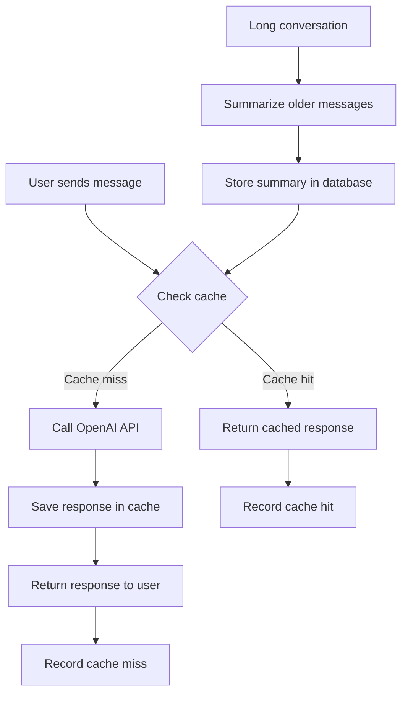

# Prompt and Conversation Caching

This document provides a comprehensive overview of the prompt and conversation caching implementation in the Intelligent Transcription application.

## Overview

The caching system optimizes OpenAI API usage by:
1. Caching responses for similar prompts
2. Summarizing long conversation history
3. Tracking and analyzing cache performance
4. Providing tools to monitor and manage the cache

## Components

### 1. Cache Service (`src/Services/CacheService.php`)

The `CacheService` provides core caching functionality:

- **In-memory cache**: For ultra-fast responses in the same session
- **Database cache**: For persistent caching across sessions
- **Analytics**: Tracks cache hits, misses, and performance metrics
- **Cache management**: Tools to clear or optimize cached content

```php
class CacheService {
    // Core caching methods
    public function getCachedConversation($cacheKey);
    public function cacheConversation($conversationId, $messages);
    public function clearCache($conversationId = null);
    
    // Analytics methods
    public function recordCacheHit($conversationId, $responseTime, $tokensSaved);
    public function recordCacheMiss($conversationId, $responseTime, $tokensUsed);
    public function getCacheAnalytics($conversationId = null);
}
```

### 2. Summarizer Service (`src/Services/SummarizerService.php`)

The `SummarizerService` optimizes conversation history:

- **Conversation summarization**: Condenses older messages to reduce token usage
- **Token management**: Ensures conversations stay within token limits
- **AI-based summarization**: Uses OpenAI to create high-quality summaries
- **Original content preservation**: Stores original messages for later reference

```php
class SummarizerService {
    public function summarizeConversation($conversationId, $maxTokens = 3000);
    public function expandSummary($messageId);
    private function createSummary($messages);
}
```

### 3. Prompt Utilities (`src/Utils/PromptUtils.php`)

The `PromptUtils` class provides tools for optimizing prompts:

- **System prompt management**: Stores and retrieves standard prompts
- **Token counting**: Estimates token usage for optimization
- **Cache key generation**: Creates consistent keys for cache lookups
- **Prompt optimization**: Structures prompts for better cache hit rates

```php
class PromptUtils {
    public static function estimateTokenCount($text);
    public static function getSystemPrompt($name = 'chat', $customContent = null);
    public static function createOptimizedPrompt($messages, $transcriptionContext = '');
    public static function generateCacheKey($messages);
    public static function calculateTokenSavings($originalMessages, $cachedMessages = null);
}
```

### 4. Analytics Controller (`src/Controllers/AnalyticsController.php`)

The `AnalyticsController` visualizes cache performance:

- **Dashboard**: System-wide cache performance overview
- **Conversation analytics**: Detailed metrics for specific conversations
- **Cache management UI**: Tools to clear or optimize the cache

```php
class AnalyticsController {
    public function showCacheDashboard();
    public function showConversationAnalytics($conversationId);
    public function clearCache($conversationId = null);
    public function optimizeCache();
}
```

## Database Schema

The caching system uses several database tables:

### Chat Conversations Table Extensions

```sql
ALTER TABLE chat_conversations 
ADD COLUMN prompt_cache_id TEXT,
ADD COLUMN cache_hit_count INTEGER DEFAULT 0,
ADD COLUMN cache_miss_count INTEGER DEFAULT 0,
ADD COLUMN last_cache_hit TIMESTAMP;
```

### Chat Messages Table Extensions

```sql
ALTER TABLE chat_messages
ADD COLUMN is_summarized BOOLEAN DEFAULT 0,
ADD COLUMN original_content TEXT,
ADD COLUMN token_count INTEGER;
```

### Cache Analytics Table

```sql
CREATE TABLE IF NOT EXISTS cache_analytics (
    id INTEGER PRIMARY KEY AUTOINCREMENT,
    conversation_id TEXT NOT NULL,
    is_cache_hit BOOLEAN NOT NULL DEFAULT 0,
    response_time_ms INTEGER NULL,
    tokens_saved INTEGER NULL,
    tokens_used INTEGER NULL,
    created_at TIMESTAMP DEFAULT CURRENT_TIMESTAMP,
    FOREIGN KEY (conversation_id) REFERENCES chat_conversations(id) ON DELETE CASCADE
);
```

### Prompt Templates Table

```sql
CREATE TABLE IF NOT EXISTS prompt_templates (
    id TEXT PRIMARY KEY,
    name TEXT NOT NULL,
    content TEXT NOT NULL,
    description TEXT NULL,
    token_count INTEGER NULL,
    usage_count INTEGER DEFAULT 0,
    last_used TIMESTAMP NULL,
    created_at TIMESTAMP DEFAULT CURRENT_TIMESTAMP
);
```

## Cache Flow Diagram



## Optimization Strategies

1. **Prompt Structuring**
   - Place static content at the beginning of prompts
   - Keep user-specific content at the end
   - Maintain consistent formatting

2. **System Prompt Caching**
   - Store common system prompts in the database
   - Use them consistently across sessions
   - Track usage for future optimizations

3. **Conversation Summarization**
   - Keep recent messages intact
   - Summarize older messages
   - Preserve original content for reference

4. **Token Management**
   - Track token usage for all messages
   - Automatically summarize when approaching limits
   - Optimize for maximum context with minimum tokens

## Performance Metrics

The cache system tracks several key metrics:

- **Cache hit rate**: Percentage of requests served from cache
- **Response time**: Average response time for cache hits vs. misses
- **Tokens saved**: Estimated token savings from cache hits
- **Cost savings**: Estimated cost reduction from caching

## Frontend Integration

The caching system integrates with the frontend through:

1. **Analytics Dashboard**
   - System-wide performance metrics
   - Daily and monthly usage charts
   - Estimated cost savings visualization

2. **Conversation UI**
   - Cache hit indicators on messages
   - Links to conversation analytics
   - Summarization indicators

3. **Cache Management**
   - Tools to clear conversation cache
   - System-wide cache optimization
   - Performance monitoring

## Benefits

1. **Reduced API Costs**
   - Fewer API calls means lower OpenAI costs
   - Summarization reduces token usage

2. **Improved User Experience**
   - Faster responses from cache hits
   - Consistent answers for similar questions

3. **Performance Insights**
   - Analytics help identify optimization opportunities
   - Token usage tracking improves resource planning

## Future Optimizations

1. **Semantic Caching**
   - Cache responses based on meaning, not exact text
   - Implement embeddings for similarity matching

2. **Predictive Preloading**
   - Preload likely responses based on user patterns
   - Warm cache during low-usage periods

3. **Dynamic Summarization**
   - Adapt summarization based on content importance
   - Preserve key information while reducing tokens