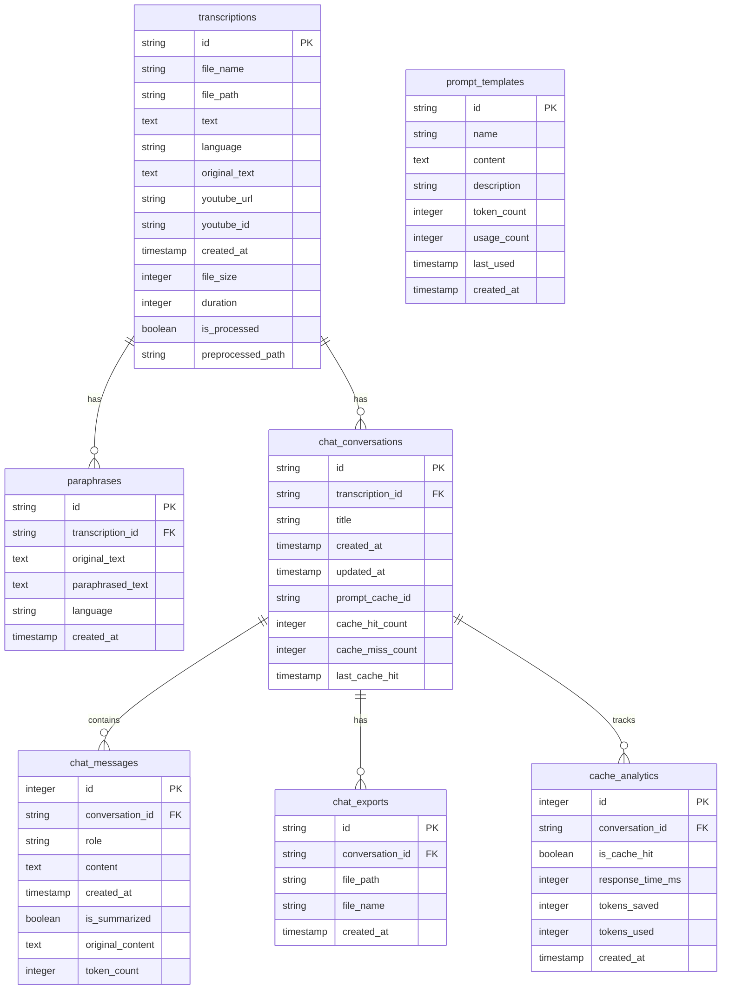

# Database Integration

This document details the SQLite database integration implemented in the Intelligent Transcription application.

## Overview

The application previously used a file-based storage system for transcriptions, chat histories, and exports. Now, it includes a SQLite database to provide more robust data storage, better querying capabilities, and improved data relationships.

## Database Schema

The database consists of the following tables:

### Tables Structure



### Relationships

- One transcription can have multiple paraphrases
- One transcription can have multiple chat conversations
- One chat conversation can have multiple messages
- One chat conversation can have multiple exports
- One chat conversation tracks multiple cache analytics events
- System uses multiple prompt templates for different contexts

## Database Configuration

Database settings are configured in `config.php`:

```php
// Database configuration
define('DB_PATH', __DIR__ . '/database/transcription.db');
define('USE_DATABASE', true); // Set to false to continue using file-based storage
```

The `USE_DATABASE` flag allows toggling between the database and file-based storage, ensuring backward compatibility.

## Initializing the Database

To create or update the database schema, run the migration script:

```bash
php migrate.php
```

This script:
1. Creates the database file if it doesn't exist
2. Creates all required tables with proper indexes and constraints
3. Reports success or issues with the migration

## Database Manager

The `DatabaseManager` class (`src/Database/DatabaseManager.php`) provides a centralized interface for all database operations:

```php
use Database\DatabaseManager;

// Get a database connection
$db = DatabaseManager::getConnection();

// Execute a query with parameters
$stmt = DatabaseManager::query(
    "SELECT * FROM transcriptions WHERE id = :id", 
    [':id' => $transcriptionId]
);
$result = $stmt->fetch(\PDO::FETCH_ASSOC);

// Get the last inserted ID
$id = DatabaseManager::lastInsertId();

// Transaction handling
DatabaseManager::beginTransaction();
try {
    // ... perform multiple database operations
    DatabaseManager::commit();
} catch (\Exception $e) {
    DatabaseManager::rollback();
    // Handle error
}
```

## Services Integration

### TranscriptionService

The `TranscriptionService` now supports both database and file-based storage:

- **Saving Transcriptions**: Stores transcription results in the database with additional metadata
- **Retrieving Transcriptions**: Prioritizes database retrieval with fallback to files
- **Listing Transcriptions**: Provides database-based listing with pagination
- **Deleting Transcriptions**: Removes from database and associated files

```php
// Example: Getting a transcription with database support
public function getTranscriptionResult($resultId)
{
    if ($this->useDatabase) {
        try {
            $sql = "SELECT * FROM transcriptions WHERE id = :id LIMIT 1";
            $stmt = DatabaseManager::query($sql, [':id' => $resultId]);
            $result = $stmt->fetch(\PDO::FETCH_ASSOC);
            
            if ($result) {
                // Format database result
                return [
                    'success' => true,
                    'id' => $result['id'],
                    'text' => $result['text'],
                    // ... other fields
                ];
            }
            
            // Fallback to file-based retrieval
            return $this->getTranscriptionResultFromFile($resultId);
        } catch (\Exception $e) {
            // Handle database errors
            return $this->getTranscriptionResultFromFile($resultId);
        }
    } else {
        // Use original file-based approach
        return $this->getTranscriptionResultFromFile($resultId);
    }
}
```

### ChatService

The `ChatService` manages chat-related data with the following database integrations:

- **Conversations**: Create, list, retrieve, and delete conversations
- **Messages**: Store and retrieve chat messages within conversations
- **Exports**: Track and manage exported chat histories
- **Caching**: Optimize responses by caching prompts and conversations
- **Analytics**: Track cache performance metrics

```php
// Example: Creating a conversation
public function getOrCreateConversation($transcriptionId = null, $title = null)
{
    if (!$this->useDatabase) {
        // Generate temporary ID for non-database mode
        return FileUtils::generateUniqueId();
    }
    
    try {
        // Check if conversation exists for transcription
        if ($transcriptionId) {
            $sql = "SELECT id FROM chat_conversations WHERE transcription_id = :id LIMIT 1";
            $stmt = DatabaseManager::query($sql, [':id' => $transcriptionId]);
            $conversation = $stmt->fetch(\PDO::FETCH_ASSOC);
            
            if ($conversation) {
                return $conversation['id'];
            }
        }
        
        // Create new conversation
        $conversationId = FileUtils::generateUniqueId();
        $title = $title ?? "Conversation " . date('Y-m-d H:i:s');
        
        $sql = "INSERT INTO chat_conversations (id, transcription_id, title) VALUES (:id, :transcription_id, :title)";
        DatabaseManager::query($sql, [
            ':id' => $conversationId,
            ':transcription_id' => $transcriptionId,
            ':title' => $title
        ]);
        
        return $conversationId;
    } catch (\Exception $e) {
        // Fallback to temporary ID on error
        return FileUtils::generateUniqueId();
    }
}

// Example: Using caching when sending messages
public function sendMessage($message, $conversationId)
{
    // Generate a cache key based on the conversation context and message
    $cacheKey = PromptUtils::generateCacheKey($this->getConversationMessages($conversationId), $message);
    
    // Check if we have a cached response
    $cachedResponse = $this->cacheService->getCachedConversation($cacheKey);
    if ($cachedResponse) {
        // Record cache hit and metrics
        $this->cacheService->recordCacheHit($conversationId);
        return $cachedResponse;
    }
    
    // No cache hit, proceed with API call
    $response = $this->callChatAPI($message, $conversationId);
    
    // Store response in cache for future use
    $this->cacheService->cacheConversation($conversationId, $response, $cacheKey);
    $this->cacheService->recordCacheMiss($conversationId);
    
    return $response;
}
```

## Backward Compatibility

The database implementation maintains backward compatibility with the previous file-based storage:

1. **Dual Storage Support**: Services check the `USE_DATABASE` flag to determine storage method
2. **Fallback Mechanisms**: If database operations fail, services fall back to file-based methods
3. **Database Toggle**: Database usage can be disabled by setting `USE_DATABASE` to `false`

## Advanced Features

With the database integration, the application now supports:

1. **Conversation History**: Users can view their past conversations
2. **Message Persistence**: Chat messages are stored persistently across sessions
3. **Transcription Metadata**: Additional metadata (file size, duration, etc.) is stored
4. **Relationship Management**: Proper linking between transcriptions, conversations, and exports
5. **Prompt and Conversation Caching**: Optimized response times through intelligent caching
6. **Cache Analytics**: Performance metrics for cache efficiency monitoring

### Caching System

The caching system uses several components to optimize responses and reduce API costs:

1. **PromptUtils**: 
   - Manages prompt templates for consistent formatting
   - Generates cache keys based on conversation content
   - Estimates token counts for conversations

2. **CacheService**:
   - Stores and retrieves cached responses
   - Tracks cache hit/miss metrics
   - Provides analytics on cache performance

3. **SummarizerService**:
   - Compresses long conversations to reduce token usage
   - Maintains summary of older messages while keeping recent ones intact
   - Improves cache hit rate by removing volatile content

```php
// Example: Tracking cache analytics
public function recordCacheHit($conversationId, $responseTime = null, $tokensSaved = null)
{
    if ($this->useDatabase) {
        // Update conversation metrics
        $sql = "UPDATE chat_conversations 
                SET cache_hit_count = cache_hit_count + 1, 
                    last_cache_hit = CURRENT_TIMESTAMP 
                WHERE id = :id";
        DatabaseManager::query($sql, [':id' => $conversationId]);
        
        // Add detailed analytics if provided
        if ($responseTime !== null) {
            $sql = "INSERT INTO cache_analytics 
                    (conversation_id, is_cache_hit, response_time_ms, tokens_saved) 
                    VALUES (:conversation_id, 1, :response_time, :tokens_saved)";
            
            DatabaseManager::query($sql, [
                ':conversation_id' => $conversationId,
                ':response_time' => $responseTime,
                ':tokens_saved' => $tokensSaved
            ]);
        }
    }
}

## Error Handling

Database operations include comprehensive error handling:

1. **Try/Catch Blocks**: All database operations are wrapped in try/catch blocks
2. **Error Logging**: Database errors are logged for debugging
3. **Graceful Degradation**: Services fall back to file-based methods on database errors
4. **Transaction Protection**: Multi-step operations use transactions to ensure data integrity

## Data Migration

For existing applications with file-based data, consider implementing a data migration script to:

1. Scan existing result files in the `results/` directory
2. Import data into the appropriate tables
3. Keep original files for backward compatibility

## Security Considerations

The SQLite database implementation includes:

1. **Prepared Statements**: All queries use prepared statements to prevent SQL injection
2. **Input Validation**: Input data is validated before database operations
3. **File Permissions**: Database files should have proper file system permissions
4. **Error Message Security**: Database error details are not exposed to users