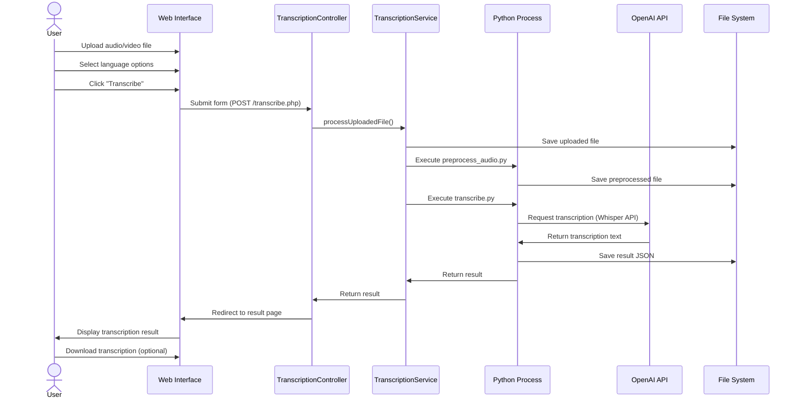
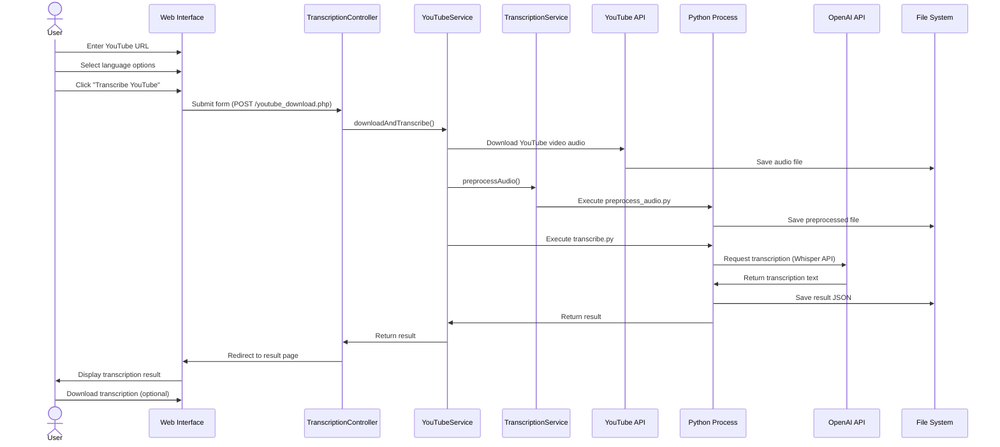
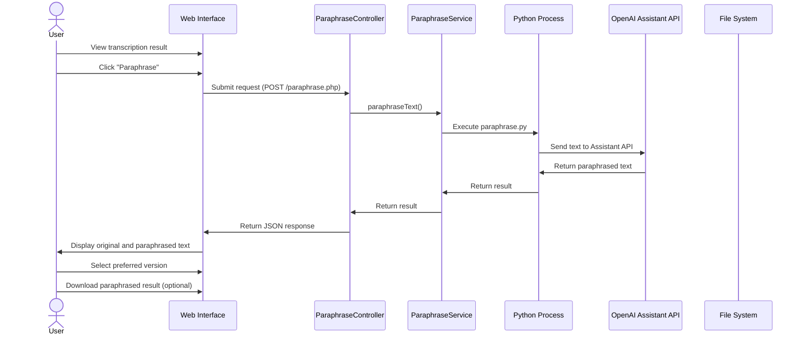
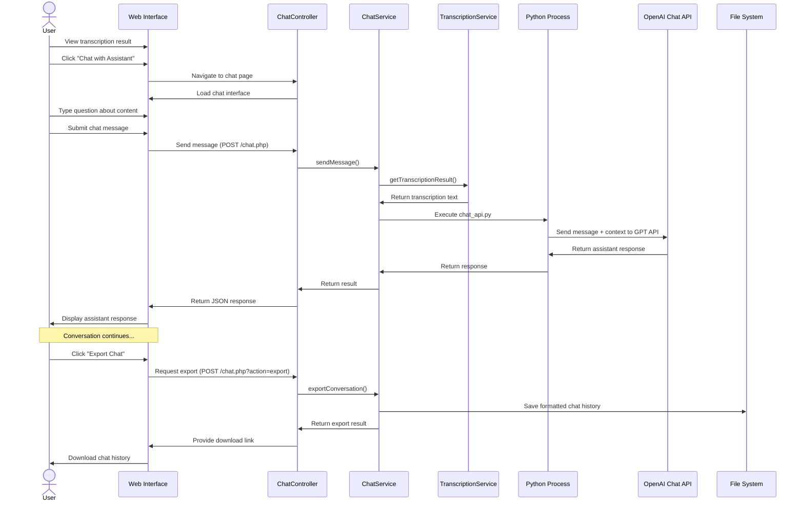
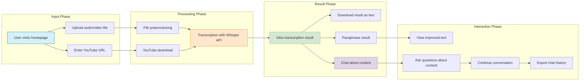

# User Workflows

This document outlines the main user workflows of the Intelligent Transcription application with sequence diagrams to illustrate the interactions between the user, the application, and external services.

## 🔄 File Upload and Transcription Workflow

This workflow describes the process of uploading an audio or video file and getting it transcribed.

## 🔄 YouTube Video Transcription Workflow

This workflow describes the process of transcribing content from a YouTube URL.

## 🔄 Paraphrasing Workflow

This workflow describes the process of paraphrasing a transcription to improve clarity and readability.

## 🔄 Contextual Chat Workflow

This workflow describes the process of engaging in a contextual chat about the transcribed content.

## 🔄 Complete User Journey Workflow

This diagram shows a complete user journey, combining multiple workflows.

## 📋 User Story: First-time User Experience

1. **Homepage Entry**
   - User visits the application homepage
   - User sees the file upload section and YouTube URL input

2. **Input Selection**
   - User chooses to upload a local audio file
   - User selects language options (e.g., automatic detection)
   - User clicks "Transcribe" button

3. **Processing**
   - System shows loading indicator
   - File is uploaded, preprocessed, and transcribed
   - System redirects to results page

4. **Result Exploration**
   - User views transcription text
   - User explores available options (download, paraphrase, chat)

5. **Feature Discovery**
   - User clicks "Chat with Assistant"
   - User is taken to chat interface with transcription context loaded
   - User asks questions about the transcribed content
   - User receives contextually relevant answers

6. **Export and Sharing**
   - User exports chat history
   - User downloads transcription

## 📋 User Story: Regular User Experience

1. **Efficient Input**
   - User enters YouTube URL directly
   - User selects preferred language and "Force language" option
   - User initiates transcription

2. **Result Review**
   - User quickly reviews transcription for accuracy
   - User immediately clicks "Paraphrase" for improved readability

3. **Content Interaction**
   - User begins chat session with specific questions
   - User conducts focused conversation about key topics
   - User exports conversation for documentation purposes

4. **Multiple Session Management**
   - User starts a new transcription in another tab
   - User efficiently switches between multiple transcriptions
   - User leverages previously learned workflow patterns