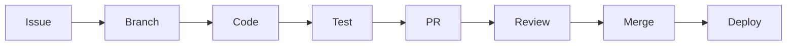

# Development Workflows

## Vue d'ensemble

Workflows et processus de développement pour Intelligent Transcription.

## 🔄 Workflow Git

### Branches
```
main              # Production
├── develop       # Intégration
├── feature/*     # Nouvelles fonctionnalités
├── bugfix/*      # Corrections de bugs
└── hotfix/*      # Corrections urgentes
```

### Cycle de Développement


## 🎯 Feature Development

### 1. Planification
```bash
# Créer une issue GitHub
# Définir les critères d'acceptation
# Estimer la complexité
```

### 2. Développement
```bash
# Créer une branche
git checkout -b feature/transcription-segments

# Développer avec TDD
# 1. Écrire les tests
# 2. Implémenter le code
# 3. Refactorer
```

### 3. Tests
```bash
# Backend
vendor/bin/phpunit

# Frontend
cd frontend
npm run test
npm run type-check
npm run lint
```

### 4. Pull Request
```bash
# Pousser la branche
git push origin feature/transcription-segments

# Créer PR avec template
# Demander review
# Répondre aux commentaires
```

## 🐛 Bug Fixing

### Process
1. **Reproduire** le bug localement
2. **Écrire un test** qui échoue
3. **Corriger** le code
4. **Vérifier** que le test passe
5. **Tester** manuellement
6. **PR** avec description détaillée

## 📋 Code Review

### Checklist Reviewer
- [ ] Code respecte les standards
- [ ] Tests présents et passent
- [ ] Pas de code dupliqué
- [ ] Documentation mise à jour
- [ ] Performance acceptable
- [ ] Sécurité vérifiée

### Checklist Auteur
- [ ] Auto-review effectuée
- [ ] Tests ajoutés/mis à jour
- [ ] Documentation mise à jour
- [ ] Commit messages clairs
- [ ] Pas de code debug

## 🚀 Release Process

### Semantic Versioning
```
MAJOR.MINOR.PATCH
- MAJOR: Breaking changes
- MINOR: New features
- PATCH: Bug fixes
```

### Steps
```bash
# 1. Créer release branch
git checkout -b release/1.2.0

# 2. Mettre à jour version
# package.json, composer.json

# 3. Générer changelog
# CHANGELOG.md

# 4. Tests finaux
# Tous les tests doivent passer

# 5. Tag et merge
git tag v1.2.0
git push origin v1.2.0
```