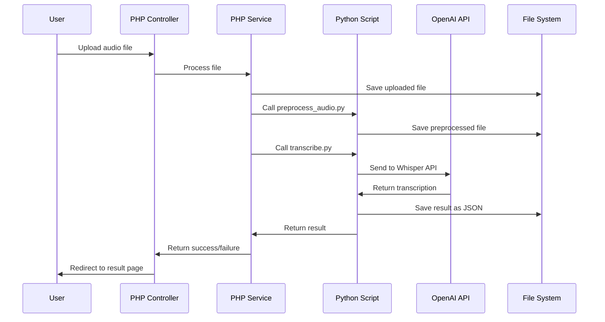
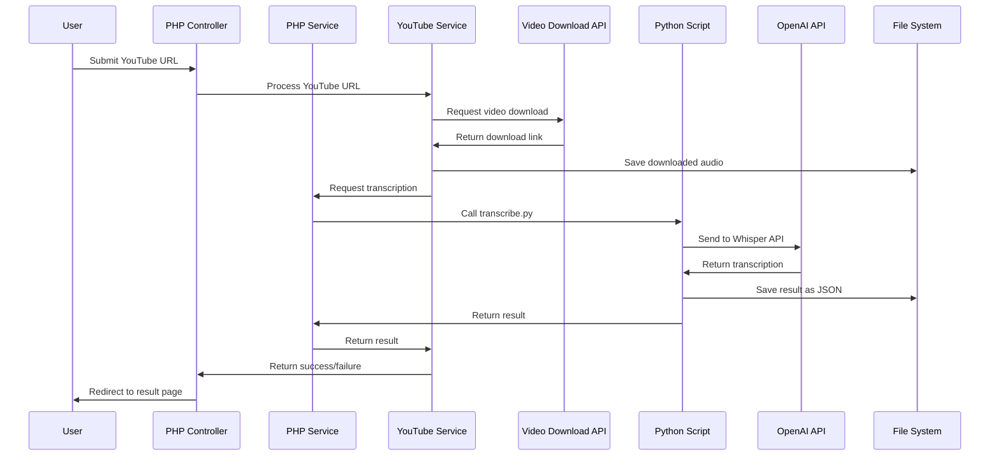
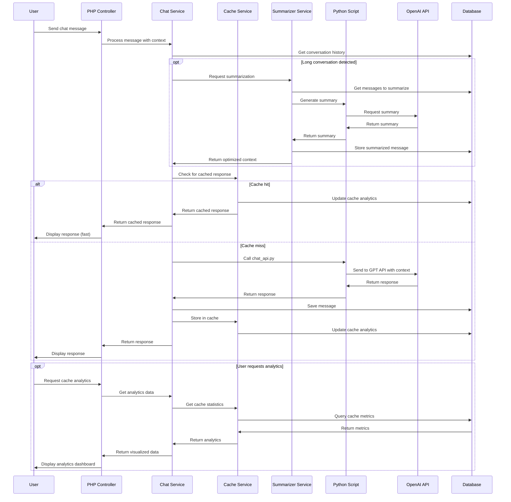

# Backend Architecture

## 🏗️ Architecture Overview

The Intelligent Transcription application follows a modified MVC (Model-View-Controller) pattern architecture. The application combines PHP and Python for different aspects of functionality, with PHP handling web requests, file management, and request routing, while Python manages AI interactions and complex processing tasks.

### Core Components

1. **Controllers**: Handle user requests and coordinate responses
2. **Services**: Implement business logic and interact with external APIs
3. **Utils**: Provide helper functions for common tasks
4. **Templates**: Manage the presentation layer using Twig
5. **Python Scripts**: Handle AI model interactions and audio processing

## 📊 Component Details

### Controllers

Controllers are responsible for handling HTTP requests, processing form data, and delegating tasks to appropriate services. They then return responses or redirect users.

**Key Controllers:**
- `TranscriptionController`: Manages audio file uploads and YouTube URL processing
- `ChatController`: Handles chat interactions and context management
- `ParaphraseController`: Manages text paraphrasing requests

Example controller flow:
```php
public function handleFileUpload() {
    // 1. Validate user input
    // 2. Process file upload using TranscriptionService
    // 3. Redirect to results page or error page
}
```

### Services

Services contain the core business logic of the application. They handle interactions with external APIs, file processing, and data manipulation.

**Key Services:**
- `TranscriptionService`: Manages audio preprocessing and transcription
- `YouTubeService`: Handles YouTube video downloading and processing
- `ChatService`: Manages chat interactions with the OpenAI API
- `ParaphraseService`: Handles text paraphrasing with OpenAI
- `CacheService`: Implements caching for prompt and conversation optimization
- `SummarizerService`: Manages conversation summarization for context length optimization
- `AnalyticsController`: Provides visualization of cache and performance metrics

Example service flow:
```php
public function transcribeAudio($filePath, $outputPath, $language = null) {
    // 1. Validate file
    // 2. Call Python script to access OpenAI Whisper API
    // 3. Process and return results
}
```

### Utils

Utility classes provide helper functions used across the application.

**Key Utils:**
- `FileUtils`: File management operations
- `ResponseUtils`: HTTP response handling
- `YouTubeUtils`: YouTube-specific functionality
- `PromptUtils`: Optimizes prompts for better caching and token efficiency

### Python Integration

Python scripts handle interactions with OpenAI APIs and complex processing tasks.

**Key Python Scripts:**
- `transcribe.py`: Interfaces with OpenAI Whisper API
- `paraphrase.py`: Uses OpenAI for text enhancement
- `preprocess_audio.py`: Optimizes audio files for API processing

## 📈 Data Flow Diagrams

### Transcription Process Flow



### YouTube Download Process Flow



### Chat Process Flow with Caching



## 💾 File Storage

The application uses the file system for storage, with several key directories:

- `/uploads/`: Temporary storage for original uploaded files
- `/temp_audio/`: Preprocessed audio files optimized for the API
- `/results/`: JSON files containing transcription results
- `/exports/`: Text files containing exported chat histories

Each file uses a unique identifier generated at creation time, typically combining a timestamp with a unique ID.

Example result structure:
```json
{
  "success": true,
  "text": "Transcribed content here...",
  "language": "fr",
  "original_text": "Original text if translation was applied"
}
```

## 🔄 Error Handling

The application implements comprehensive error handling:

1. **PHP Error Handlers**: Custom error and exception handlers in bootstrap.php
2. **Service Error Returns**: Consistent error response format
3. **Python Exception Handling**: Try/except blocks with JSON error responses
4. **Debug Logs**: Multiple log files for different aspects of the application

Example error response:
```json
{
  "success": false,
  "error": "Detailed error message here"
}
```

## 🔌 External Integrations

The application integrates with several external services:

1. **OpenAI API**:
   - Whisper API for transcription
   - ChatGPT API for contextual chat
   - Assistant API for paraphrasing

2. **Video Download API (loader.to)**:
   - Used for downloading audio from YouTube videos
   - Handles both regular videos and YouTube Shorts

Integration is primarily managed through Python scripts, which handle API authentication, request formatting, and response processing.